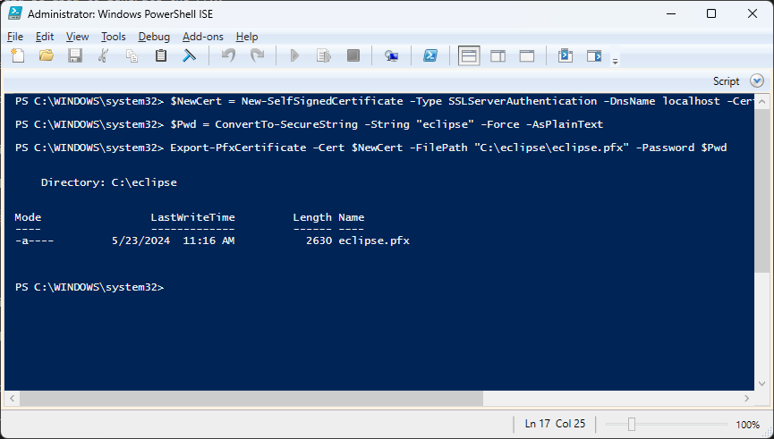

# Hosting Eclipse w/ IIS on Windows Server 2022+

## Requirements

The following user guide was built using Windows Server 2022 Standard Edition running via Hyper-V on a Windows 11 desktop computer on Milyli's private network.

Nearly all steps followed in this guide can be followed regardless of the host machine. A physical machine running Windows Server, virtual windows server infrastructure, or a Windows virtual machine hosted on a cloud service such as Azure or AWS are all viable options.

Native cloud service hosting is supported but not covered via this document.

You will be required to create a non-admin service account for creating the application pool. This service account will need to be able to access the python command. It is recommended that a new, separate service account is used for this purpose to limit access of the web server to only Eclipse files.

Python will be installed on the server as a part of this guide.

### Supported Windows Versions

- Windows Server 2022+ Standard Edition
- IIS 10.0+

## Server Setup and Pre-Requisites

### Server Packages

Download and install the following packages.

- [Install the .NET Core Hosting Bundle](https://learn.microsoft.com/en-us/aspnet/core/host-and-deploy/iis/hosting-bundle?view=aspnetcore-8.0)
- [Install Visual C++ Redistribute Package](https://learn.microsoft.com/en-us/cpp/windows/latest-supported-vc-redist?view=msvc-170)
- (Recommended) [PowerShell 7](https://learn.microsoft.com/en-us/powershell/scripting/install/installing-powershell-on-windows?view=powershell-7.4#msi)

### Installing Python

At the heart of the Eclipse Server is a .NET application that makes use of Python. There are two considerations that should be made when installing Python.

1. Python needs to be accessible by the identity account of the Eclipse application pool.
2. Python will also need to be used during setup to install the Presidio Analyzer and load the default spaCy model.

Eclipse requires Python **3.10.x** or higher. This guide was written using Python 3.12.4.

Python can be downloaded from the [python.org website](https://www.python.org/downloads/windows/).

During the installation it is recommended to install python for all users. If this is not possible, python will need to be installed for both your administrator account and the service account created for the Eclipse application pool identity.

To install for all users, use the following prompts during the installation process.

- Select use admin privileges when installing py.exe
- add python.exe to PATH


- Select **Customize installation**
- Ensure that *for all users* is selected for the py launcher
- Select **Next**


- On the next screen, select **Install Python 3.12 for all users**

Without selecting this option, python will be installed for only the currently logged in user. If you elect to skip this step, you must install python for the service account that the Eclipse application pool identity will run as!


### Installing Analyzers and Default spaCy Model

Python will be used to install the presidio analyzers and install Eclipse's default language model.

Launch PowerShell 7 as an administrator and use the following command to install the presidio analyzers.

``` bash
pip install presidio_analyzer
```


After the install is successful, install the default language model with the following command.

``` bash
python -m spacy download en_core_web_lg
```


### Extract the Website

Milyli will share a zip file with you that contains the Eclipse server directory. This zip should be extracted to a root folder. In this example, we extract everything to `C:\eclipse-server`.

Ensure that all zip contents are in this root folder.


The eclipse server directory structure consists of the following:

- The `www` directory contains the files for the website and API.
- The `data` directory is used for storing app data, requests, responses, and databases.
- The `pi-extractor` directory contains the python application.

### Create a Developer Certificate

The Eclipse container requires an HTTPS certificate start and run. For Alpha and Beta purposes, a self-signed developer certificate can be used. If possible, a proper certificate from a valid certificate authority should be used.

A developer certificate can easily be created using Windows PowerShell and the following commands.

1. Define a certificate variable using the `New-SelfSignedCertificate` command.
2. Create (and retain) a password for the cert.
3. If using this certificate with other Eclipse setups, export the PFX for the newly created Self Signed Certificate.

``` bash
$NewCert = New-SelfSignedCertificate -Type SSLServerAuthentication -DnsName localhost -CertStoreLocation Cert:\CurrentUser\My

$Pwd = ConvertTo-SecureString -String "eclipse" -Force -AsPlainText

Export-PfxCertificate -Cert $NewCert -FilePath "C:\eclipse\eclipse.pfx" -Password $Pwd
```



### Create a System Account

In this guide, we use a local account to serve as the service account. A service account should be created and use based on your companies IT policies. The account does not need to be a local admin on the server or have any domain permission.

This account will only be used to grant limited permissions to the eclipse directory and act as the identity of the website application pool.

## IIS Setup

In the following steps, we'll create the IIS website from scratch. At any point, feel free to utilize any standard operating procedures your organization utilizes for hosting websites on your network in IIS.

### Create the Application Pool

In the following steps we will create the application pool that will be used by the website.

1. Launch IIS Manager as an administrator.
2. Create a new application pool.
3. Give the application name, we chose `eclipse-server`.
4. Choose `No Managed Code` for the **.NET CLR Version** option.
5. Leave **Managed pipeline mode** set to `integrated`.

    

6. Once created, click Advanced settings in the menu on the right.
7. Set **Enabled 32-Bit Application** to `true`.
8. Change **Start Mode** to `Always Running`.
9. Change **Idle Time-out (minutes)** to `0`.

    

10. Change the **ApplicationPoolIdentity** to the service account created during setup.

### Create the Website

In these steps, we will create and configure the base website for the server. This assumes that built-in default website is removed beforehand. If a website already exists with a valid certificate, then this website should be able to be used instead of following these instructions.

#### New Default Website

1. Create a new website in IIS and provide it a name such as `EclipseWeb` or `Default Website`.
2. Choose the `DefaultAppPool`.
3. Set the the **Physical path** to the default IIS path at `C:\inetpub\wwwroot\`.
4. (Optional) Configure the host name if you are running multiple websites from this server.
5. Add an https binding and select the previously created or installed SSL Certificate.
6. Leave all other checkboxes unchecked.
7. Create the website.

    

8. Select **Advanced settings** and set **Preload Enabled** to `True`.

    

#### Existing Default Website

If you have a pre-existing default website, then the only change that is recommended is to ensure that **Preload Enabled** is set to `True` in the advanced settings of the website.

### Create the Virtual App

The actual Eclipse server will be setup as an application under the default website. To setup the application follow these steps using an existing website or the one created in the previous section.

1. Right click on the website and select `Add application`.
2. Input `eclipse` as the alias.
3. Choose the `eclipse-server` application pool created in this guide.
4. Set the **Physical path** to the `C:\eclipse-server\www` directory or wherever the root folder is for the unzipped Eclipse server files.


### Configure Directory Permissions

The identity of the application pool needs permission to read, write, and execute python scripts from the Eclipse server. To set these permissions follow these steps.

1. On the root directory `eclipse-server`, right click and select properties.
2. On the `Security` tab, click `Edit`.
3. Click Add then search for and add the service account (ours is `eclipse-server` in this guide).

    

4. Select the service account.
5. Add the permissions `Read & Execute`, `List folder contents`, and `Read` and click Ok.

    

6. Open the directory, right click on the `data` directory, and select properties.
7. On the `Security` tab, ensure that the service account has access to the folder.
8. Ensure that the account has `Modify` and `Write` permissions on the directory.

### Restart IIS

Either from IIS Manager or command prompt, restart the web server. If using the IIS Manager, you can do so from the root node.


Otherwise, open PowerShell 7 as an administrator and input the command `iisreset`.

## Wrap-up and Troubleshooting

Depending on how the website the virtual application was created under is configured, the Eclipse server should now be running!

In this guide, by leaving everything at default, the server is available under localhost and can be accessed by navigating to `https://localhost/eclipse/swagger`. The URL will be different based on the configuration of your website.


### Checking logs

Logs for the website can be accessed from two locations. Normal, IIS application logs will automatically appear in the servers Event Viewer. You can review these logs by hitting the `windows key` typing in `event` and selecting the `Event Viewer` app.

In the Event Viewer, navigate to `Windows Logs -> Application` and look for application errors.

Specific logs can also be accessed directly from the eclipse logs stored in the `C:\eclipse-server\data\logs` directory.


### HTTP Error 500.32 - Failed to load .NET Core host


This error indicates that the server does not have the pre-requisites for IIS to run a .NET Core application. Ensure that the C++ redistribute package was installed earlier in this guide.

### HTTP Error 500.19 - Internal Server Error

This is most likely due to one of two issues.

1. The .NET Core Hosting Bundle was installed prior to IIS being installed

    To remedy this, re-download the hosting core bundle and select Repair. Try navigating to the website again.

    [Install the .NET Core Hosting Bundle](https://learn.microsoft.com/en-us/aspnet/core/host-and-deploy/iis/hosting-bundle?view=aspnetcore-8.0)

2. The Application Pool does not have access to the location that web.config is located.

    Ensure that the Identity user that the application pool is running as has `Read & Execute`, `List folder contents`, and `Read` to the root eclipse folder.

### Failed to start process python

This error will present itself both in the host servers Event Viewer and the Eclipse servers logs.

The full error will resemble the following string:

``` bash
Description: The process was terminated due to an unhandled exception.
Exception Info: Milyli.Eclipse.Server.Analyzer.Exceptions.ExternalProcessException: Failed to start process python
---> System.ComponentModel.Win32Exception (2): An error occurred trying to start process python with working directory C:\eclipse-server\www. The system cannot find the file specified.
```

This error indicates that the user the application pool is running under does not have access to python. Either install python for all users or log into the service account and ensure that python is installed for that user.

Installing for the individual account was not tested for the writing of this guide.

### ModuleNotFoundError: No module named 'presidio_analyzer'

When attempting to test an Eclipse endpoint, if the response from Eclipse includes this message, it is due to Eclipse not being able to find the presidio analyzer python module. Eclipse by default checks for the module to be installed at the system level in python rather than at the user level. Logging into the server on an administrator account and running the `pip install presidio_analyzer` should remedy this.
