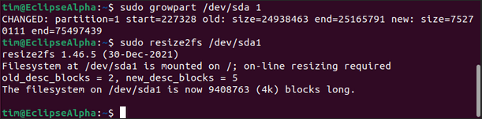

# Hosting Eclipse w/ Docker Engine on Ubuntu

## Requirements

The following user guide was built using the Ubuntu Noble 24.04 (LTS, 64-bit) running via Hyper-V on a Windows 11 desktop computer on Milyli’s private network.  

Nearly all steps followed in this guide can be followed regardless of the host machine of the Linux distribution including a Linux server running Ubuntu, a Windows Server with an Ubuntu VM, or a VM hosted on a cloud service such as Azure or AWS.

Native cloud service hosting is supported but not covered via this document.

This guide will install and use Docker Engine via Docker’s apt repository rather than use Docker Desktop for Linux. If you are using an existing server, you should ensure that old docker files are removed. For more details refer to the [Docker removal instructions](https://docs.docker.com/engine/install/ubuntu/#uninstall-old-versions).

Note: For more general information about Docker and its related components, please refer to the [official documentation](https://www.docker.com/).

### Supported Ubuntu Versions (64-bit)

- Ubuntu Noble 24.04 (LTS)
- Ubuntu Mantic 23.10 (EOL: July 12, 2024)
- Ubuntu Jammy 22.04 (LTS)
- Ubuntu Focal 20.04 (LTS)

## VM Setup and Docker Engine Installation

### Installing Ubuntu VM

Your approach to hosting Linux should not impact the following steps if a supported 64-bit Ubuntu distribution is used. This guide utilizes **Ubuntu 22.04 LTS** installed on a networked computer with **Hyper-V Quick Create**.

Launch the Hyper-V Quick Create tool and select Ubuntu 22.04 LTS.


### Configuring the VM and Connecting

Follow the prompts and leave all settings as default to begin with. On the Virtual Machine Created Succesfully screen, select **Edit Settings...**


In a later step, we will push the docker container image into this VM. Now is the best time to expand the number of resources on the VM to better accommodate Eclipse. For this guide, we made the following adjustments.

1. Increase the memory on the virutal machine from `4096` to `8192`.
2. Change the dynamic memory range from `512` to `1048576` to `2048` to `8192` or pick a static memory range.
3. Edit the hard drive and choose to expand it from `12 GB` to `36 GB` or a greater number.

If your organization has additional requirements for the VM, make those changes now. Once complete, connect to and log into the VM.

You will be required to create a user account as a part of the operating system's first startup. This account will have access to perform root commands. This guide will utilize this user for all following steps.


### Expand the Hard Disk

Hyper-V partitions the hard drive at the initial 12 GB automatically as a part of the quick-create process.  

Ubuntu hosted on Hyper-V may have issues when trying to use `lvdisplay`,`lvextend`, or `GParted`. For this guide, `Cloud Guest Utils` was used.

1. Open the terminal.
2. Run the command `sudo fdisk -l` and note the name of the primary Linux filesystem (if following along, it should be `/dev/sda1`).

    

3. Install Cloud Guest Utils using the command `sudo apt install cloud-guest utils`
4. Grow the partition using the command `sudo growpart /dev/sda 1`
5. Resize the partition using the command `sudo resize2fs /dev/sda1`



### Install Docker Engine From Repository

To install Docker Engine the full, detailed instructions should be followed. These are available on the official [docker guide](https://docs.docker.com/engine/install/ubuntu/#install-using-the-repository).

Follow the guide up until the step for running the `hello-world` docker container.


## Create a Developer Certificate

The Eclipse container requires an HTTPS certificate PFX in order to start and run. For Alpha and Beta purposes, an self-signed developer certificate can be used. If possible, a proper certificate from a valid certificate authority should be used to generate the PFX.

A developer certificate can easily be created using Windows PowerShell and the following commands.

1. Define a certificate variable using the `New-SelfSignedCertificate` command.
2. Create (and retained) a password for the cert.
3. Export the PFX for the newly created Self Signed Certificate.

``` bash
$NewCert = New-SelfSignedCertificate -Type SSLServerAuthentication -DnsName localhost -CertStoreLocation Cert:\CurrentUser\My

$Pwd = ConvertTo-SecureString -String "eclipse" -Force -AsPlainText

Export-PfxCertificate -Cert $NewCert -FilePath "C:\eclipse\eclipse.pfx" -Password $Pwd
```


## Load Eclipse Container Image

### Create Volume Folders

If you have organization specific processes for creating folders, please follow those at this point.

1. In the `Home` folder create a new folder named `eclipse`.
2. Inside the `eclipse` folder, create three additional folders named `logs`, `https`, and `db`.
3. Update the volume folder permissions to 777 with the `chmod` command.


### Store Container Image and Cert on VM

If the VM is connected to the internet, download the container image file Milyli shared with you to the `eclipse` folder.

The PFX created in the previous step should be placed in the `eclipse\https` directory.

If the files are on a host machine and you do not already have tools for pushing files into your virtual machine, SSH is a powerful and secure way of doing so. Using the SCP PowerShell command from the host machine enables easy transfer to VM.

If you are unsure of the IP address of your virtual machine, use the following command and note the Get-NetNeighbor command `Get-NetNeighbor -LinkLayerAddress 00-15-5d-*` and take note of it for later steps.


The easiest way to make SSH requests to the VM is by installing `openssh server` with the terminal command `sudo apt install openssh-server`.

For the example file transfers below, the image and PFX file have been saved on the VM host machine inn the `c:\eclipse` directory.

1. Launch PowerShell/Windows Terminal.
2. Change the directory to `c:\eclipse`.
3. From the host machine, run the SCP command `scp eclipse.pfx [username]@[ipaddress]:/home/[username]/eclipse/https`.

    

4. From the host machine, run the SCP command `scp eclipse.server.alpha-6 [username]@[ipaddress]:/home/[username]/eclipse`.

    

### Load Container Image

Finally, load the image into Docker Engine with the docker load command.

```bash
sudo docker load -i eclipse.server.alpha-6
```


## Running Eclipse Container

With the container loaded, we're ready to get it running. Replace the values of the parameters in the following command with the ones that match the work you've done in previous steps.

```bash
sudo docker run -dt -e "ASPNETCORE_URLS=https://+:443" -e "ASPNETCORE_Kestrel__Certificates__Default__Password=[YOURPASSWORD]" -e "ASPNETCORE_Kestrel__Certificates__Default__Path=/https/[YOURCERTIFICATENAME].pfx" -e "ASPNETCORE_HTTPS_PORT=443" -p 8000:443 --name Milyli.Eclipse.Server.Web -v /[PATHTOHTTPSFOLDER]/https:/https:ro -v /[PATHTODBFOLDER]/db:/db:rw -v /[PATHTOLOGSFOLDER]/logs:/logs:rw milyli.eclipse.server
```

Below is an example with the values from this guide.

```bash
sudo docker run -dt -e "ASPNETCORE_URLS=https://+:443" -e "ASPNETCORE_Kestrel__Certificates__Default__Password=eclipse" -e "ASPNETCORE_Kestrel__Certificates__Default__Path=/https/eclipse.pfx" -e "ASPNETCORE_HTTPS_PORT=443" -p 8000:443 --name Milyli.Eclipse.Server.Web -v /home/tim/eclipse/https:/https:ro -v /home/tim/eclipse/db:/db:rw -v /home/tim/eclipse/logs:/logs:rw milyli.eclipse.server
```


If following along, Eclipse should now be running on your VM!

Navigate to `https://localhost:8000/swagger/index.html` on the VM to verify it's running successfully!


At this point, if you followed this guide exactly as written, Eclipse should also be accessible via the host machine using the IP address: `https://[IPADDRESS]:8000/swagger/index.html`. Additional steps will be required of your organization's network administrator to ensure the Eclipse server is visible to your Relativity instance. 

In order for the Eclipse Relativity Application to access the server, the agent(s) servers where the Eclipse Agent will be created must have access to the base URL of the Eclipse server.

## Useful Commands

### Get container Id

```bash
sudo docker ps -a
```

### View container logs

```bash
sudo docker logs container_id
```

### Stop a running container

```bash
sudo docker container stop container_id
```

## Running Docker Engine Rootless

If needed, both Docker Engine and Eclipse can be run rootless. Milyli provides limited technical support for this configuration beyond confirming that it is valid. We strongly suggest reading and following the [official Docker documentation](https://docs.docker.com/engine/security/rootless/#prerequisites) for doing so.
